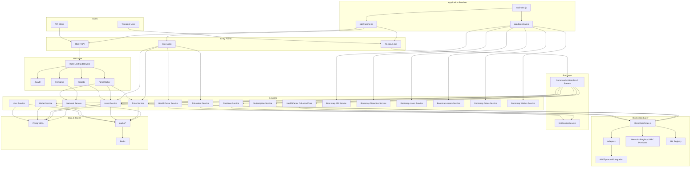

# AAVE Health Factor Bot

A **Telegram bot and backend service** for monitoring **AAVE lending
positions and Health Factor risk** across EVM-compatible blockchain
networks.

The system provides **read-only wallet tracking**, track **Health
Factor** and liquidation risk, monitors **price changes**, and sends **Telegram
notifications** when risk conditions are met.

---

## 📑 Table of Contents

- [Overview](#-overview)
- [Features](#-features)
- [System Architecture](#-system-architecture)
- [Project Structure](#-project-structure)
- [Core Services](#-core-services)
- [Notifications](#-notifications)
- [Internationalization](#-internationalization)
- [Public API](#-public-api)
- [Cron Jobs](#-cron-jobs)
- [Storage](#-storage)
- [Security](#-security)
- [Limitations](#-limitations)
- [License](#-license)

---

## 📌 Overview

This project is a **modular layered backend** for monitoring DeFi lending positions in AAVE.

It combines:

- Telegram bot (user interaction)
- REST API (public endpoints)
- Service layer (business logic)
- Blockchain adapter (AAVE integration)
- Redis cache
- PostgreSQL storage
- Cron jobs for background processing

The system is **read-only** and does not execute transactions.

---

## 🚀 Features

- Monitor **AAVE lending positions**
- Track **Health Factor** (from AAVE account data)
- Detect **liquidation risk**
- Track **token prices**
- **Price change alerts (>5%)**
- **Quick asset lookup via ticker input (BTC, ETH)**
- Telegram notifications
- Public REST API:
  - `/prices`
  - `/assets`
  - `/networks`
- Redis caching
- PostgreSQL persistence

---

## 🏗 System Architecture

The application starts from `src/index.js`, initializes core services, and runs:

- Telegram bot
- REST API
- Cron jobs

### Runtime structure

- **Telegram bot** handles user interaction, wallet management, position views, Health Factor checks, and ticker-based price lookup.
- **REST API** exposes only public read-only endpoints:
  - `GET /health`
  - `GET /assets`
  - `GET /price/:ticker`
  - `GET /networks`
- **Cron jobs** periodically:
  - sync assets
  - sync prices
  - sync Health Factor
  - send price and HF alerts

### Service boundaries

- **API layer** uses:

  - `Asset Service`
  - `Price Service`
  - `Network Service`

- **Bot layer** uses:

  - `Wallet Service`
  - `Subscription Service`
  - `Positions Service`
  - `HealthFactor Collector`
  - `Asset Service`
  - `Price Service`

- **Cron layer** uses:
  - `Asset Service`
  - `Price Service`
  - `HealthFactor Service`
  - `Price Alert Service`

### Blockchain integration

Blockchain access is centralized in `src/blockchain/index.js`, which resolves protocol adapters, RPC providers, ABI registry, and AAVE protocol integration.

### Data layer

- **PostgreSQL** stores persistent application data
- **Redis** is used through cache modules for fast reads and temporary cached state

---

## 📦 Project Structure

src
├── api
├── bot
├── services
├── blockchain
├── cron
└── database

---

## 🧩 Core Services

### Asset Service

- Manage supported assets
- Store metadata
- Handle collateral parameters

### Price Service

- Fetch and normalize prices
- Cache in Redis
- Detect price changes (\>5%)

### Network Service

- Manage blockchain networks
- Store RPC endpoints and chain IDs

### Wallet Service

- Add/remove wallets
- Validate format
- Link to users

### User Service

- Manage users
- Stores user data and preferences

### Positions Service

- Fetch AAVE reserves
- Calculate collateral, debt, borrow capacity

### HealthFactor Service

- Retrieves account risk data from AAVE (getUserAccountData)
- Tracks Health Factor
- Detects liquidation risk

### Subscription Service

- Manage plans (Free / Pro)
- Wallet & notification limits
- Feature gating

---

## 🔔 Notifications

- Health Factor alerts (based on AAVE account data)
- Price change alerts (\>5%)

---

## 🌍 Internationalization

- English
- Russian

Language is auto-detected from Telegram.

---

## 🔌 Public API

### Health

GET /health
Returns service status

### Assets

GET /assets
Returns supported tokens

### Prices

GET /price/:ticker
Returns token price

### Networks

GET /networks
Returns supported networks

---

## ⚙️ Cron Jobs

Located in src/cron:

assetsUpdater.cron.js — updates asset metadata

priceUpdater.cron.js — updates prices and triggers price alerts

HFUpdater.cron.js — updates Health Factor data

---

## 🗄 Storage

### PostgreSQL

- users
- wallets
- healthfactors
- assets
- prices
- networks

### Redis

- ABI caching
- assets caching
- price caching
- network caching
- user caching
- wallet caching
- fast reads

---

## 🔐 Security

- No private keys stored
- Read-only wallet tracking
- Input validation
- Sensitive data not exposed

---

⚠️ Limitations

- Polling-based updates (cron jobs, no event system)
- No queue system (BullMQ / RabbitMQ)
- Limited RPC failover handling
- Data freshness depends on RPC providers

---

## 📜 License

MIT
